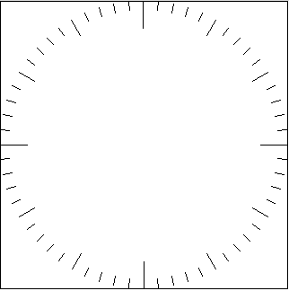

# Project notes for pinetime-app

This is an app for the pinetime smart watch from [the pine64 website](https://www.pine64.org/pinetime/).

## Introduction

This is a (mostly) chronological set of notes relating to research and discoveries as I make them.
***There will be errors in this document!***

Please scroll to the bottom of this document for the latest (and hopefully corrected) information.

## Development process

To develop an application for this device, you must be comfortable with:

1. Building programs written in C, C++ or Rust.
2. These programs will be built at command line by a cross-compiler because the instruction set for the CPU on the pinetime is almost certainly not going to be the same as your development machine.
3. Developing programs on the Raspberry Pi.
    * According to the pine64 website, this looks to be the best combination for developing the application and loading it onto the smart watch.
    * You will need to set up:
        * the tool chain
        * an editor environment (which can be as simple as mousepad, or a full-blown IDE -- your choice!)
        * the physical connection between the RasPi and the pinetime
4. Analyzing and fixing problems that won't be obvious :-)

## Application Functionality

As delivered, the pinetime comes pre-loaded with a proprietary application that the author will not share the source for, but which allows you to at least verify the components work.
This means we will be loading up our own application fairly quickly, destroying the pre-loaded application in the process.

### Verify the development environment

The very first thing we need to to is verify our tool chain.
As mentioned previously we are targetting the RasPi for the development platform, and will need to do some hardware setup to enable us to program the pinetime.

To do that, load the pinetime with some pre-written applications.
They don't even need to be written in your target language: we are only trying to prove that you can write a program, send it to the pinetime, and the pinetime runs it.  To that end, we will load:

1. "blinky" (link?) to change the intensity of the backlight from off, low, medium, high, then recycle.
2. "Hello World" (link?) to set the backlight to high, and print the word "Hello" on the screen.
    * For this we will need the AdaFruit driver display library (link?)

If you take the time to go through these steps, you will have proven that you can:

* Write a program
* Compile the program to create the binary image
* Transfer that image to the pinetime
* Have it run on the pinetime.

While you are waiting for your pinetime to arrive, you can be doing research and maybe setting up your RasPi development environment.

## Ongoing development

Initially this project will be primarily documentation as I continue my research.

I like to structure my GIT repos to have the:

* README.md at the root of the project
* docs/ directory for all project notes, generated docs, etc.
* src/ directory for the application source
* build/ directory for the binary artifacts (intermediate object files, executable, etc.)
    * this binary image is what will be transmitted to the pinetime

## Description of the pinetime

The pinetime smart watch works much like an Arduino, in that it can only run one program/image at a time.  It does not run linux, so you cannot load multiple applications up dynamically.  As I understand it, all the functionality has to be in one application.

I'll refer you to the [the pine64 website](https://www.pine64.org/pinetime/) again for the specs, etc. on this device; I don't see any point in reproducing that information here.

You could download the documentation on each of the parts inside the pinetime (I did :-) but you will find that there is not much information for the programmer there; there is mostly builder-level stuff there:

* dimensions of parts
* locations of pins
* characteristics of signals on each pin

It is much more important for us to understand the hardware environment that the program will be running in, and specifically how to drive the various devices that are attached to the CPU:

1. The display (link?)
2. How much memory does this thing have?
    * 64K EPROM
    * 512K RAM in a separate module
3. The RTC (Real Time Clock)
    * Hmmmm, this device does not have one.  Funny thing for a watch :-)
    * It does have a ticker, so once it knows the current time, it can keep up with it after that.
    * It seems that when we power it up, the pinetime must reach out to a Bluetooth service to obtain the current time.  After it is initialized, it can then track time (presumably until the battery goes flat, at which point it must obtain the time again)
4. The accelerometer
    * this helps detect wrist flicks to activate the display
    * There is also a dedicated step counter inside the accelerometer.
        * How to access it?
        * How to retrieve the current step count for display?
        * How to reset the step count?
5. The heart rate sensor
    * How to access it?
    * How to retrieve the current heart rate for display?

There is useful information on the [the pine64 website](https://www.pine64.org/pinetime/) that gives such things as port numbers, that we will need to obtain access to the various devices.
We will certainly use libraries to access the devices, and in my case, I will only use a library that I can obtain the source code for, since I might have to convert C++ to C (for instance).

## Drawing the watchface

Once the development environment is verified and you have loaded at least some pre-written, known working application, we can turn to the design of this application.

This application will draw the watchface as a set of vectors.
For this we need to know the x,y coordinates of every line that needs to be drawn on the watchface.

I like a circular watchface, with:
* the 12, 3, 6, and 9 o'clock tick marks to be large
* the 1, 2, 4, 5, 7, 8, 10, 11 o'clock tick marks to be medium
* each remaining minute tick mark to be small.

This leaves me room in each corner for display icons, and buttons to select other functionality.
There is also the possibility of utilizing the push button on the side of the watch but I'm not sure about that yet.

### How to calculate the location of each x,y co-ordinate?

There is a simple trigonometric formula that you can use to determine this:

    x = cx + r * cos(a)
    y = cy + r * sin(a)

    Where r is the radius, cx,cy the origin, and a the angle.

We know that the diameter of the watchface will be the dimension of the pinetime display, 320x320 pixels.  Some documentation has it at 240x240 pixels but I'll assume 320x320 for now.  It will be easy enough to recalculate if needed.

The values to plug into the formula are:

* r is the radius (which is **half** the diameter)
* cx,cy the origin (or the center of the circle: 160,160)
* a the angle (which ranges 0 - 360, or 6 * the current minute)

Please remember that our aim is to calculate these x,y coordinates ahead of time so we don't have to do it on the pinetime!
The reason for this is that we don't know yet what the capabilities of the C runtime library are, and in any case, calculating them ahead of time and just using the pre-caculated values as needed is much more efficient.
Also, it lets me draw the watchface on a graphics context and grab the screen shot above :-)

Now then, back to calculating the x,y locations of the start and end point of each tick mark.
For this, we need to take the formula described above, and apply it to each of the 60 tick marks on the watch face:

    for (int i = 0; i < 60; i++)
    {
      int tick_length = 10;  // default to 10
      // set length of tick mark
      if (i == 0 || i == 15 || i == 30 || i == 45)
      {
        tick_length = 30;
      }
      else if (i ==  5 || i == 10 || i == 20 || i == 25
            || i == 35 || i == 40 || i == 50 || i == 55 )
      {
        tick_length = 20;
      }
      else
      {
        tick_length = 10;
      }

      retval->ticks[i].angle_degrees = i * 6;
      retval->ticks[i].angle_radians = retval->ticks[i].angle_degrees * G_PI / 180.0;
      retval->ticks[i].start_x = center_x + retval->radius_pixels * cos(retval->ticks[i].angle_radians);
      retval->ticks[i].start_y = center_y + retval->radius_pixels * sin(retval->ticks[i].angle_radians);;
      retval->ticks[i].end_x = center_x + (retval->radius_pixels - tick_length) * cos(retval->ticks[i].angle_radians);
      retval->ticks[i].end_y = center_y + (retval->radius_pixels - tick_length) * sin(retval->ticks[i].angle_radians);;
      // x = cx + r * cos(a)
      // y = cy + r * sin(a)

      // Where r is the radius, cx,cy the origin, and a the angle.
    }

For these trig functions (in the C runtime library) to work, the degrees must be expressed in **radians**.
This means that 0 - 360 degrees is expressed in radians as 0 - 6.178466 radians, which is what the `cos()` and `sin()` functions need.
Note that `6.178466 radians = 2 * PI` .

This snippet of code is initializing an array of 60 X,Y co-ordinates, each element of the array contains two such x,y coordinates: one for the start, one for the end of the line to draw.

You can also see some tests at the top of the loop that determine what length the tick mark should be for each of the minute marks on the watch face.

What comes out of this snippet of code is an array, 60 elements (one for each minute-mark on the watch face), containing a set of two x,y coordinates, the start and the end position of the tick mark at each minute position.

**Remember, this is not a program you have to write or run, it is only included here so you can see how the x,y coordinates were calculated.  Please do not request this code, as I regret I cannot share it.**

The application in this repository will simply include the result of these calculations in the form of an array of 60 elements, all pre-populated with the correct x,y coordinates.

If it turns out the pionetime display is really 240x240, it will be trivial to generate a new array with the new x,y coordinates.

## How to drive the display?

(work in progress)

